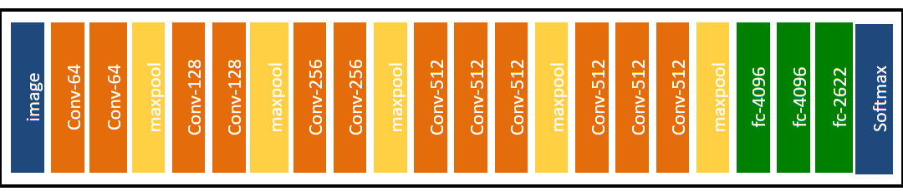

# face-recognition

I have used vgg face model as my base model
The structure of the VGG-Face model is demonstrated below.

Research paper denotes the layer structre as shown below.

link to the pre-trained model's weight is [here](https://drive.google.com/open?id=1CPSeum3HpopfomUEK1gybeuIVoeJT_Eo)

used transfer learning for the perpose of this assingment. 
trained the model by keeping the top layers unfrozen and other layers frozen  

compiled the model by using Adam optimize with learning rate equal to 1e-5, 
categorical_crossentropy is used as the loss function and categorical_accuracy as the Evaluation Metric

categorical_accuracy checks to see if the index of the maximal true value is equal to the index of the maximal predicted value.  
Categorical crossentropy is a loss function that is used for single label categorization. This is when only one category is applicable for each data point. In other words, an example can belong to one class only.  
Use categorical crossentropy in classification problems where only one result can be correct.

## Note
The block before the Target block must use the activation function Softmax.

this model is trained on Google Colabrotory with GPU enabled runtime
after traning for arround   epochs I got the categorical_accuracy as 
